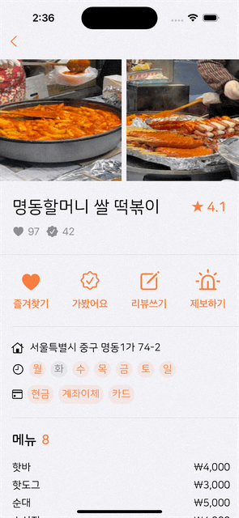
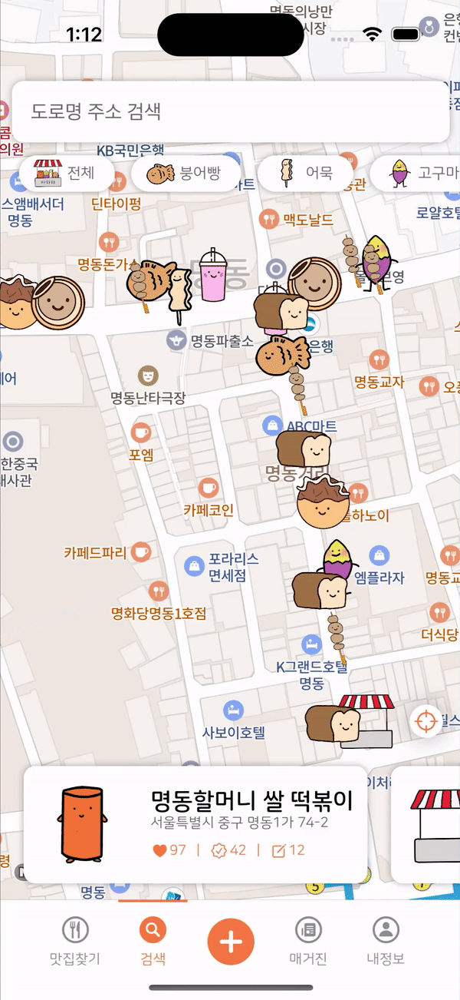
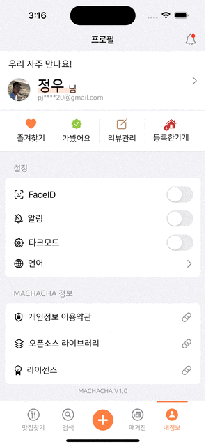
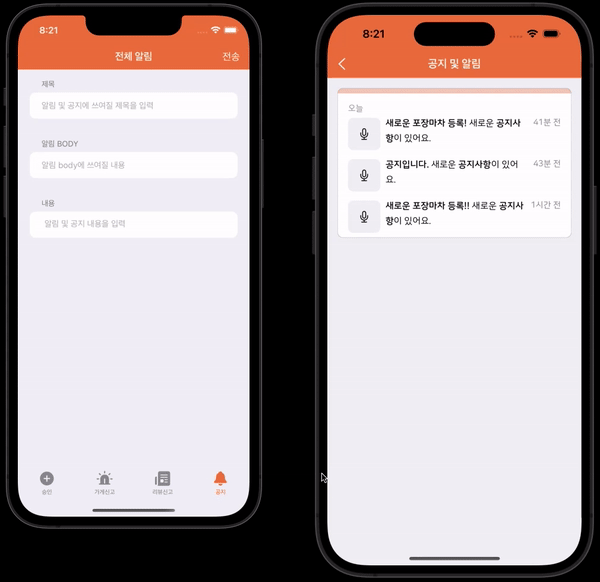
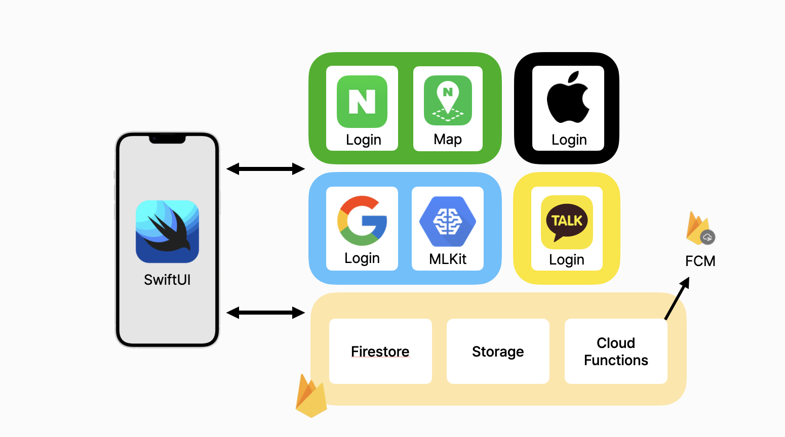
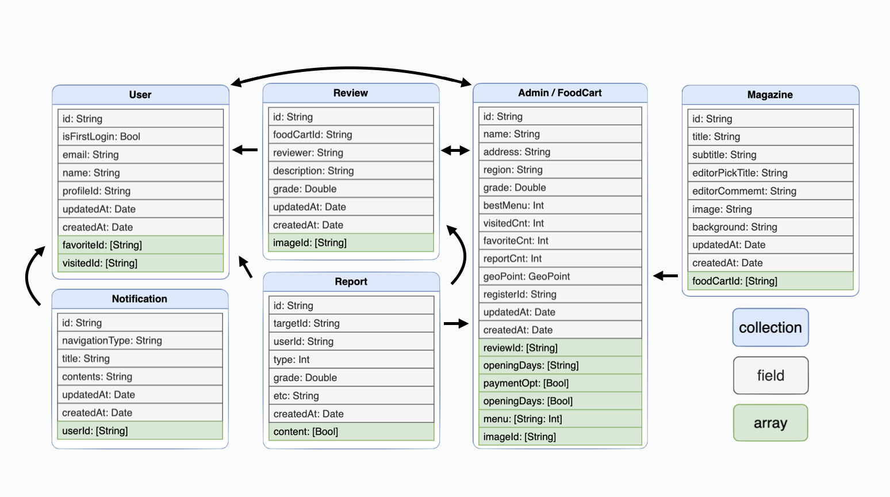

# 🍢 마차챠


## 👋 앱 소개

<p align="center"></p>

```
포장마차 관련 정보들(위치, 결제 수단, 기록 등)을 알려주기 위한 '사용자 니즈'를 파악하고 서비스
```

### **페르소나**

```
포장마차의 위치 및 영업 시간을 정확히 알고 싶은 사람들
```

### **서비스 지역**

```
명동
```

## 👨‍👩‍👧‍👦 참여자
<div align="center">
  <table style="font-weight : bold">
      <tr align="center">
          <td colspan="5"> 팀 목표 : 많은 기술적 도전과 재미있게  </td>
      </tr>
      <tr>
          <td align="center">
              <a href="https://github.com/GeonHyeongKim">                 
                              
              </a>
          </td>
          <td align="center">
              <a href="https://github.com/suekim999">                 
                              
              </a>
          </td>
          <td align="center">
              <a href="https://github.com/jwoo820">                 
                              
              </a>
          </td>
          <td align="center">
              <a href="https://github.com/jeoneeee">                 
                              
              </a>
          </td>
          <td align="center">
              <a href="https://github.com/Heodoo">                 
                              
              </a>
          </td>
      </tr>
      <tr>
          <td align="center">신기술을 사용할래요</td>
          <td align="center">UIKit + SwiftUI, 이미지 캐싱</td>
          <td align="center">UIKit + SwiftUI, 모듈화</td>
          <td align="center">Clean Code, SkeletonView 적용</td>
          <td align="center">Oauth 2.0, 코드 리뷰</td>
      </tr>
      <tr>
          <td align="center">김건형</td>
          <td align="center">김수현</td>
          <td align="center">박정우</td>
          <td align="center">이지연</td>
          <td align="center">허두영</td>
      </tr>
  </table>
</div>

## 📱 스크린샷
<Blockquote>
실제 앱 구동화면입니다
</Blockquote>

### Machacha

|  |  |  |  |  |
|:-:|:-:|:-:|:-:|:-:|
| 로그인 | Home | Detail | 리뷰 | 제보 |
|  |  |  |  |  |
| 검색 | STT | 등록 | OCR | 매거진 |
|  |  ||||
| 프로필 수정 | 설정 |  |  |  |

### MachachaAdmin

|  |  |  |
|:-:|:-:|:-:|
| 승인 | 제보(신고) | 공지알림 |
<br/>

## 🏃‍ 기능

<details>
<summary>1. Tab1(Home)</summary>
<div markdown="1">
  
```
- 큐레이션 방식으로 포장마차 데이터를 보여줌
- 알림 확인 가능
```
  
</div>
</details>
<details>
<summary>2. Tab2(지도/검색)</summary>
<div markdown="2">
    
```
- 맵뷰의 마커를 통해서 포장마차의 실제 위치를 알려줌
- 대표메뉴 기준 필터링 기능 제공
- 서비스 지역 표시
- 마커, 카드셀 에니메이션 적용
- 포장마차의 주소 기반으로 찾고자 하는 포장마자 검색 기능
- 음성 검색 기능 제공
```
  
</div>
</details>
<details>
<summary>3. Tab3(등록)</summary>
<div markdown="3">
    
```
- 현재위치 기준 위치선택 지도 뷰
- 지도 중앙 마커 기준 좌표로 가게 등록
- 가게 정보 상세 입력
- 선택한 마커 좌표를 주소로 변환하여 주소 자동 입력
- OCR을 통해 사진을 메뉴 텍스트로 변환하여 자동 입력
- 등록 성공시 음성 지원
```
  
</div>
</details>
<details>
<summary>4. Tab4(매거진)</summary>
<div markdown="4">
    
```
- 마차챠 에디터가 제공
- CardView 애니메이션
- Sticky header 적용
- Storage로부터 받아온 이미지 캐싱 처리 (kingfisher)
- Firebase로부터 받아온 가게 위치를 NaverMap에 pin 고정
```
  
</div>
</details>
<details>
<summary>5. Tab5(프로필)</summary>
<div markdown="5">
    
```
- 프로필 수정(이미지, 닉네임), Sticky header
- 즐겨찾기, 가봤어요, 리뷰관리, 등록한곳
- 알림(공지사항, Tab으로 이동(Home & 검색 & 매거진))
- WebView(개인정보 방침, 라이센스, 사용한 오픈소스)
- FaceID
- 알림 설정
- 다크모드 설정
- 다국어(한국어, 중국어) 설정
- 로그아웃/회원탈퇴
```

</div>
</details>
<details>
<summary>6. Detail(가게 상세 정보)</summary>
<div markdown="6">
    
```
- 사진 (6개 초과시 더보기(+)를 누르면 리뷰로 넘어가는 기능)
- 정보 (가게이름, 주소, 좌표, 좋아요, 가봤어요, 리뷰쓰기, 제보하기, 영업 날짜, 결제 수단, 메뉴 등)
- 가게 제보(신고)하기
- 가게 리뷰쓰기
- 리뷰 최신순 썸네일 목록 2개 제공 -> 더보기 클릭시 전체 리뷰 확인 가능
```
  
</div>
</details>
<details>
<summary>7. 로그인</summary>
<div markdown="7">
    
```
- 별도의 회원가입없는 로그인
- 소셜로그인(구글, 카카오, 애플)
- 한번 로그인했던 유저 자동 로그인
- 첫 로그인시에만 프로필 등록
```
  
</div>
</details>
<details>
<summary>8. 알림/Push Server</summary>
<div markdown="8">
    
```
- Cloud Functions을 이용한 Push Server 구현
- 관리자 앱에서 푸쉬 알림을 사용하여 사용자에게 공지사항 일괄 전송
```
  
</div>
</details>
<details>
<summary>9. Admin</summary>
<div markdown="9">

```
- 사용자가 요청한 가게 승인
- 가게 및 리뷰 신고
- 사용자 앱 전체 공지
```
  
</div>
</details>
<details>

<summary>10. ETC.</summary>
<div markdown="10">
    
```
- Custom Tab Bar
- 스케레톤뷰 적용
- 모든 기기 대응
- 모든 View 다크모드 고려
- Refresh(Pull Down)
- 애니메이션 적용
```
  
</div>
</details>
<br>

## 📚 실행 가이드 및 설치 방법
### 설치/실행 방법
* ❗️❗️아래 2가지 파일은 필수 파일임으로 파일을 요청해주세요.
```
- Config.xcconfig           // KaKaoSDK 
- GoogleService-Info.plist  // Google, FireBase
```

<br>
<details>
<summary>1. 카카오톡 로그인을 위한 사전작업</summary>
<div markdown="1">

- **config** 파일을 **Tteokbokking** 폴더에 추가한다.
    - config.xcconfig 파일 안에는 KAKAO_NAVTIVE_APP_KEY // 네이티브 앱 키가 들어있다.
    
<br>
    
- **info** 파일에 **Information Property List**에 하단의 내용들이 잘 들어가 있는지 확인
    - LSApplicationQueriesSchemes 에 item 0, item1에 각각 kakaokompassauth, kakaolink 넣기
    - KAKAO_NAVTIVE_APP_KEY에 ${KAKAO_NAVTIVE_APP_KEY}를 넣기
    - App Transport Security Settings에 Allow Arbitrary Loads 가 NO라고 되어있는지 확인
    

<br>

-  **Tteokbokking**
    - PROJECT의 Info
        - Configurations의 각각 Debug, Release 안에 있는 2개의 파일 모두 Config로 설정
            
        
    - TARGETS의 Info
        - URL Types을 펼쳐 URL Schemes에 kakao{KAKAO_NAVTIVE_APP_KEY} 가 들어있는지 확인
        
<br> 

</div>
</details>

<details>
<summary>2. 구글 로그인을 위한 사전 작업</summary>
<div markdown="1">

- **GoogleService-Info.plist**를 프로젝트에 추가
    
    - plist 추가 후 REVERSED_CLIENT_ID의 값을 복사
<br>

-  **Tteokbokking**
    - TARGETS의 Info
        - URL Types를 펼쳐 URL Schemes에 **REVERSED_CLIENT_ID**이 들어 있는지 확인
</div>
</details>

<details>
<summary>⚙️ 개발 환경</summary>
<div markdown="1">

- iOS 16.0 이상
- xcode 13.0
- iPhone 14 Pro에서 최적화됨
- 가로모드 미지원

</div>
</details>

<details>
<summary>⚒️ 활용한 기술</summary>
<div markdown="1">

- Firebase(Auth, Store, Storage, Cloud Functions)
- Google(SignIn, MLKit)
- KakaoSDK(Auth, User, Talk, Share, CommonCore 등)
- NaverSDK(NMapsMap, NaverThirdPartyLogin) 
- STT(InstantSearchVoiceOverlay)
- Kingfisher
- FlagKit
- AlertToast

</div>
</details>
<br>

## 🧩 아키텍처


## 📀 DB


## 🤝 규칙
<details>
<summary>규칙 10가지</summary>
<div markdown="1">

```
1. 존중, 배려(경어), 재미
2. 9-6시 개발하고 야근 지양하기
3. 매일 데일리 스크럼 진행 (am 10:00 ~ am 10:15 15분간)
    ◦ 특강이 있을 경우, 끝난 다음 정각부터 시작
    ◦ 보이스 및 화상 의무
    ◦ 요일마다 진행자 돌아가면서  진행하기
4. PR은 'pm 5:00'과 'am 2:00'에 각자 올리기
    ◦ Reviewer는 보조 기능인 개발자에게 걸기(GeonHyeongKim, suekim999, jwoo820, jeoneeee, Heodoo)
    ◦ Merge는 보조 기능을 역할을 맡은 개발자가 해주기
5. 개발도 중요하지만, 기록도 생각하기
    ◦ Docs Folde 참고
    ◦ Project 카반보드 활용
7. '아!’ & ‘어?’ 참아보기
8. 막힐때, @맨션을 걸어서 Pair 코딩하기
9. 세미나(발표) - 자유주제(요청)
    ◦ Seminar Folder 참고
    ◦ 목(pm 10시)
    ◦ 5~10분 (max 15분)
10. 실제로 오프라인으로 자료 수집하기
```

</div>
</details>

<details>
<summary>코드 컨벤션</summary>
<div markdown="1">

- feat/이슈번호-큰기능명/세부기능명
```
- [Feat] 새로운 기능 구현
- [Chore] 코드 수정, 내부 파일 수정, 주석
- [Add] Feat 이외의 부수적인 코드 추가, 라이브러리 추가, 새로운 파일 생성 시, 에셋 추가
- [Fix] 버그, 오류 해결
- [Del] 쓸모없는 코드 삭제
- [Move] 파일 이름/위치 변경
```

</div>
</details>

<details>
<summary>깃 브렌치</summary>
<div markdown="2">

- feat/이슈번호-큰기능명/세부기능명
```
예시)
feat/13-tab1/map
feat/13-tab1/search
feat/26-tab2/recipe
```

</div>
</details>

<details>
<summary>전체 폴더링 컨벤션</summary>
<div markdown="3">

```
📦 finalproject-machacha
| 
+ 🗂 Seminar      // 매주(3주) 진행한 세미나 자료들
|         
+ 🗂 Docs         // 매일 Daily Scrum 회의록
│         
+ 🗂 src          // Project File
│         
+------🗂 backend         // Firebase cloud function 
|
+------🗂 frontend      
        |
        +------🗂 MachachaAdmin   // Machacha admin Project
        |
        +------🗂 Machacha        // Machacha Project
```
</div>
</details>

<details>
<summary>Machacha 폴더링 컨벤션</summary>
<div markdown="4">

```
📦 Machacha
|
+ 🗂 Settings
|
+------🗂 MachachaPush    // GoogleService-Info, PushConfig
|
+------🗂 Machacha        // GoogleService-Info, Config
|
+ 🗂 Configuration
|         
+------🗂 Constants       // 기기의 제약사항: width, height를 struct로 관리
│         
+------🗂 Extensions      // extension 모음
│         
+------🗂 Fonts           // 폰트 모음: 무료 폰트인 Pretendard 사용
|
+------🗂 Localizable     // 다국어 지원 파일 
|
+------🗂 Modifiers       // View Modifier 모음
|
+------🗂 PreviewDevice   // PreView에서 Deivce 기기 보기
|
+------🗂 SoundEffects    // 소리 Assets
│         
+ 🗂 Sources
|
+------🗂 Services        // Firebase Request Router/Error
|
+------🗂 Models          // Json을 위한 Hashable, Codable, Identifiable 프로토콜을 체택한 struct 관리
│         
+------🗂 ViewModels      // ObservableObject을 체택하여 네트워크 관리
|
+------🗂 Views           // 여러 View를 모음
        |
        +------🗂 Login         // Login
        |
        +------🗂 Splash        // Splash View
        │         
        +------🗂 Home          // Tab 1
        |
        +------🗂 MapSearch     // Tab 2
        |
        +------🗂 Register(+)   // Tab 3
        │         
        +------🗂 Magazine      // Tab 4
        |
        +------🗂 Profile       // Tab 5
        |
        +------🗂 Detail        // Tab 1, 2, 4 -> 가게 상세 View
        |
        +------🗂 ETC.          // 여분의 View: CustomTabView, TextButtonClearButton 등
```
</div>
</details>

<details>
<summary>MachachaAdmin 폴더링 컨벤션</summary>
<div markdown="5">

```
📦 MachachaAdmin
| 
+ 🗂 Configuration
|         
+------🗂 Constants         // 기기의 제약사항: width, height를 struct로 관리
│         
+------🗂 Extensions        // extension 모음
|
+ 🗂 Sources
|
+------🗂 Router(Manager)   // Firebase Request Router
|
+------🗂 Models            // Json을 위한 Hashable, Codable, Identifiable 프로토콜을 체택한 struct 관리
│         
+------🗂 Network           // ObservableObject을 체택하여 네트워크 관리
|
+------🗂 Views             // 여러 View를 모음
        |
        +------🗂 ApproveView       // Tab 1 사용자가 요청한 가게 승인
        │         
        +------🗂 ReportView        // Tab 2 사용자가 신고한 가게
        |
        +------🗂 ReportReviewView  // Tab 3 사용자가 신고한 리뷰
        |
        +------🗂 NoticeView        // Tab 4 공지사항
```
</div>
</details>
<br>

## 👣 후기
- 김건형 : 어떤 프로젝트를 하는것보다 같은 사람이 중요하다는 것을 알게 된것 같아요. 지나고 보니 제가 무리한 요구한건 아닌지, 딱딱한 대화만 나눴던건 아닌지 걱정이 되네요. Map과 싸우며 언제나 든든한 정우님, 언제나 끈기있게 도전하시는 수현님, 언제나 팀의 분위기를 즐겁게 만들어 주시는 지연님, 그리고 엉뚱한 두영님까지~!! 모두모두 수고하셨습니다 😀
- 김수현 : 좋은 팀원들과 함께 기술적 도전을 많이 해볼 수 있어서 좋았습니다!
- 박정우 : 좋은 사람들과 프로젝트를 함께해서 영광이였고 필드에서 만나요~
- 이지연 : 마차챠를 통해 좋은 팀장과 좋은 팀원들을 만나 기술적 성장과 더불어 재밌게 프로젝트를 진행할 수 있었던 것 같습니다.
개발 외적으로 의사소통, 기록 의 중요성 등 많은 것들을 배울 수 있었습니다! 그동안 수고하셨습니다
- 허두영 : 개발뿐만 아니라 깃헙을 이용한 협업과 기술세미나를 통해 많이 배울수 있는 기회였습니다.
<br>

## 📄 Docs
<details>
<summary> 문서정리 </summary>
<div markdown="1">

https://github.com/APPSCHOOL1-REPO/finalproject-machacha/tree/main/docs

</div>
</details>


## 라이센스
Machacha is available under the MIT license. See the LICENSE file for more info.
